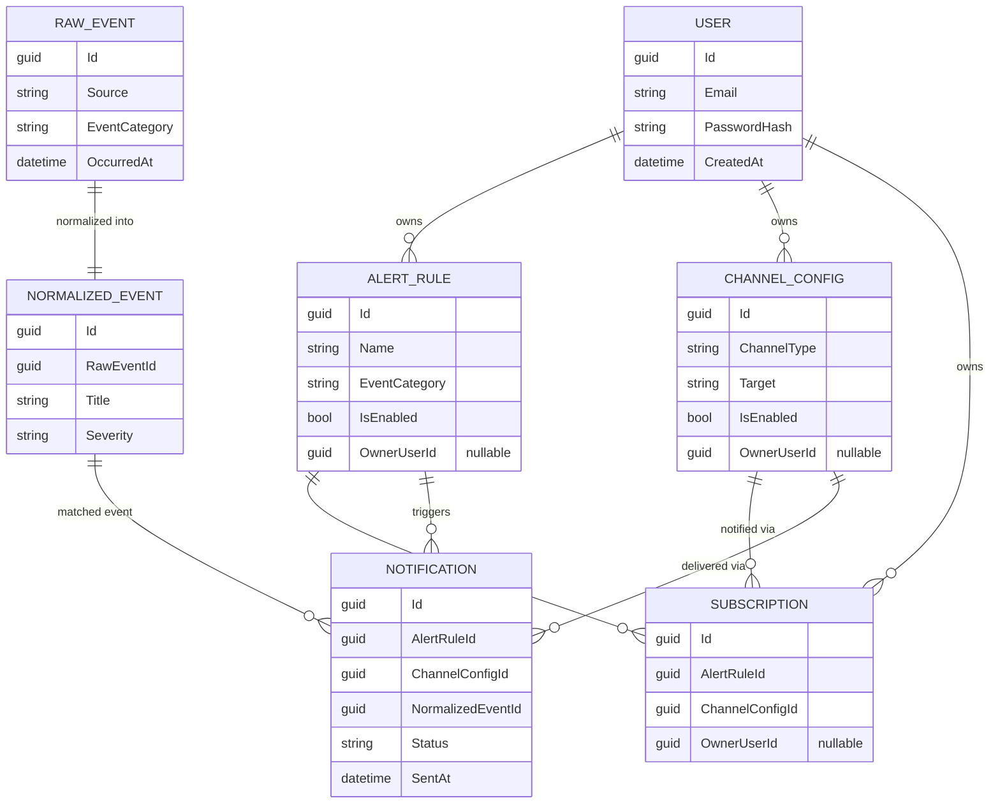

# Data model

## Entities

- **`AlertRule`**: `Id`, `Name`, `EventCategory` (BreakingNews | MarketMovement |
  NaturalDisaster), match criteria (keywords / severity threshold), `IsEnabled`, `CreatedAt`,
  `OwnerUserId` (nullable, see below).
- **`Subscription`**: `Id`, `AlertRuleId`, `ChannelConfigId` - links an alert rule to a channel
  it should notify through. `OwnerUserId` (nullable, see below).
- **`ChannelConfig`**: `Id`, `ChannelType` (string discriminator, e.g. `"slack"`, `"email"`),
  target (webhook URL or email address), `IsEnabled`, `OwnerUserId` (nullable, see below).
- **`RawEvent`**: `Id`, `Source`, `EventCategory`, raw payload, `OccurredAt` - as produced by an
  `IEventSource`.
- **`NormalizedEvent`**: `Id`, `RawEventId`, `EventCategory`, `Title`, `Description`,
  `Severity`, `OccurredAt` - the shape the matching engine actually operates on.
- **`Notification`**: `Id`, `AlertRuleId`, `ChannelConfigId`, `NormalizedEventId`, `Status`
  (Pending | Sent | Failed), `SentAt`, `Error` - one row per dispatch attempt, queryable via the
  Admin API's notification history.
- **`User`** (Phase 16, see
  [ADR-0010](../../ai/decisions/adr/0010-end-user-self-service.md)): `Id`, `Email` (unique,
  normalized to lowercase), `PasswordHash` (PBKDF2-SHA256, never the plaintext password),
  `CreatedAt`. No roles/permissions - every registered user has the same self-service
  capabilities over their own rows.

### Ownership (`OwnerUserId`)

`AlertRule`, `ChannelConfig`, and `Subscription` each carry a nullable `OwnerUserId` foreign key
to `User`:

- `null` means the row is admin/global-owned - created via the Admin API, visible and manageable
  there exactly as before Phase 16.
- A non-null value means the row belongs to that end user - created via `/api/me/*`, visible
  only to that user (and still visible/manageable via the Admin API, which has no ownership
  restriction).

This is a single shared table per entity (not a parallel per-tenant schema): the existing
Admin-facing Application use cases gained an optional trailing `ownerUserId` parameter that
filters (list) or enforces ownership (get/update/delete) only when supplied, so Admin call sites
(which pass nothing) are unaffected.

## Relationships

## Notes

This is the design-time model (Phase 01). Exact column types, indexes, and EF Core
configurations are finalized in Phase 05 (Infrastructure: persistence) and may differ slightly
in implementation; if they do, this document should be updated to match.

`User` and the `OwnerUserId` columns were added in Phase 16 (see
[ADR-0010](../../ai/decisions/adr/0010-end-user-self-service.md)) via the
`AddUsersAndOwnership` EF Core migration.
