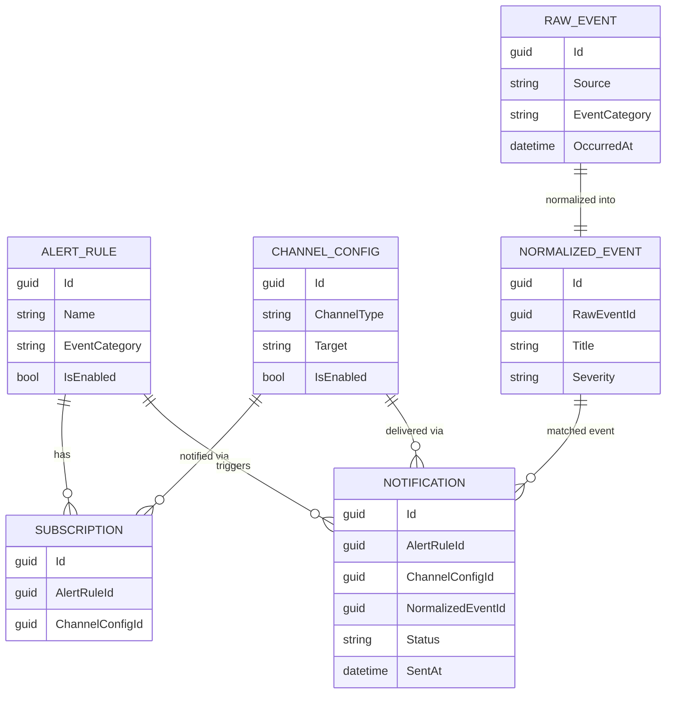

# Data model

## Entities

- **`AlertRule`**: `Id`, `Name`, `EventCategory` (BreakingNews | MarketMovement |
  NaturalDisaster), match criteria (keywords / severity threshold), `IsEnabled`, `CreatedAt`.
- **`Subscription`**: `Id`, `AlertRuleId`, `ChannelConfigId` - links an alert rule to a channel
  it should notify through.
- **`ChannelConfig`**: `Id`, `ChannelType` (string discriminator, e.g. `"slack"`, `"email"`),
  target (webhook URL or email address), `IsEnabled`.
- **`RawEvent`**: `Id`, `Source`, `EventCategory`, raw payload, `OccurredAt` - as produced by an
  `IEventSource`.
- **`NormalizedEvent`**: `Id`, `RawEventId`, `EventCategory`, `Title`, `Description`,
  `Severity`, `OccurredAt` - the shape the matching engine actually operates on.
- **`Notification`**: `Id`, `AlertRuleId`, `ChannelConfigId`, `NormalizedEventId`, `Status`
  (Pending | Sent | Failed), `SentAt`, `Error` - one row per dispatch attempt, queryable via the
  Admin API's notification history.

## Relationships

## Notes

This is the design-time model (Phase 01). Exact column types, indexes, and EF Core
configurations are finalized in Phase 05 (Infrastructure: persistence) and may differ slightly
in implementation; if they do, this document should be updated to match.
