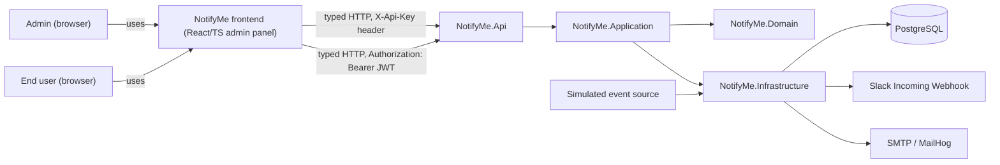
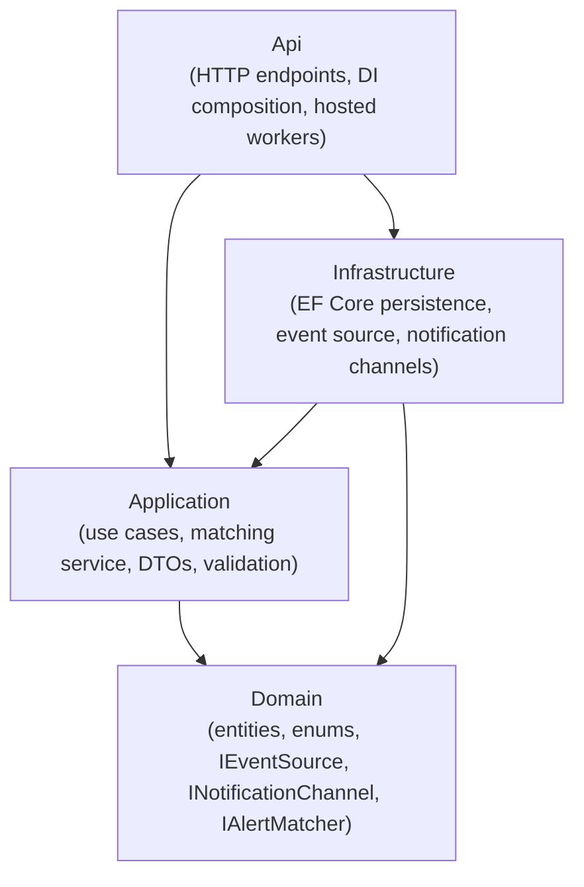

# Architecture overview

## System context

NotifyMe lets an admin configure alert rules (what kind of event, at what severity, matched on
what criteria) and channel subscriptions (where to send matching notifications: Slack, Email,
more later). Behind the scenes, an ingestion pipeline pulls in events, matches them against
active alert rules, and dispatches notifications over the subscribed channels.

Separately, an end user (not an admin) can register their own account and manage their own
alert rules, channels, and subscriptions without the Admin API key (see
[ADR-0010](../../ai/decisions/adr/0010-end-user-self-service.md)). This is an additive
capability built on the same entities and matching/dispatch pipeline, not a parallel system.

The frontend (`frontend/`, see [ADR-0009](../../ai/decisions/adr/0009-frontend-stack.md)) is a
separate Vite/React/TypeScript app, not part of the .NET solution or its dependency graph. It
talks to `NotifyMe.Api` purely over HTTP, using a client generated from the Api's own OpenAPI
document (`openapi-typescript`/`openapi-fetch`) so its view of the contract can't silently drift.
It has no direct access to `Domain`/`Application`/`Infrastructure` and is not itself deployed as
part of the backend. It hosts both the Admin panel (`/`, `/alert-rules`, ...) and the end-user
self-service screens (`/login`, `/register`, `/my`) side by side, using two entirely separate,
non-interacting auth mechanisms (Admin API key vs. JWT bearer token).

## Component / layering view

Clean Architecture with a strict dependency direction (see ADR-0002):

`Domain` has no outward dependencies. `Application` depends only on `Domain`. `Infrastructure`
implements interfaces declared in `Domain`/`Application`. `Api` is the only project allowed to
reference all three, and is where dependency injection wires concrete implementations to
interfaces.

## Pipeline flow

1. `EventIngestionWorker` polls the configured `IEventSource` (currently `SimulatedEventSource`,
   see [`event-ingestion.md`](event-ingestion.md)) on an interval.
2. Raw events are normalized into `NormalizedEvent`.
3. `EvaluateAlertRulesService` (Application layer) matches normalized events against active
   `AlertRule`s.
4. For each match, `DispatchNotificationUseCase` resolves the relevant `Subscription`(s) and
   channel(s) and sends via `INotificationChannel` (see
   [`notification-channels.md`](notification-channels.md)).
5. Each attempt is recorded as a `Notification` with a status (Pending/Sent/Failed), queryable
   via the Admin API's notification history endpoint.

## Operational concerns

- **Logging**: Serilog (console sink, configured from the `Serilog` appsettings section) with
  correlation-id log scopes threaded through the ingestion -> match -> dispatch pipeline.
- **Health**: `GET /health` reports the Postgres dependency's status via
  `Microsoft.Extensions.Diagnostics.HealthChecks`.
- **Configuration**: layered `appsettings.json` -> `appsettings.{Environment}.json` -> user
  secrets (Development only) -> environment variables, the standard ASP.NET Core host
  configuration order; no real secrets are committed anywhere in the repo (see
  [`../runbook.md`](../runbook.md)).
- **Errors**: every exception reaching the Api layer is normalized to an RFC 7807
  `ProblemDetails` response by `NotifyMeExceptionHandler`, with unrecognized exceptions mapped to
  a generic 500 (no internal details leaked) and logged server-side.

## End-user self-service auth

See [ADR-0010](../../ai/decisions/adr/0010-end-user-self-service.md) for the full rationale.
Summary:

- `POST /api/auth/register` and `POST /api/auth/login` (public, no auth required) create a
  `User` (email + PBKDF2-hashed password) and return a short-lived JWT bearer token.
- `/api/me/alert-rules`, `/api/me/channels`, `/api/me/subscriptions` require that JWT (validated
  by ASP.NET Core's JWT bearer middleware, configured from the `Jwt` appsettings section) and are
  scoped to the caller: every request resolves the caller's user id from the token's claims and
  passes it through as an optional `ownerUserId` parameter to the *same* Application-layer use
  cases the Admin API calls (with `ownerUserId: null`). A nullable `OwnerUserId` column on
  `AlertRule`/`ChannelConfig`/`Subscription` distinguishes admin/global-owned rows (`null`) from
  end-user-owned rows.
- This is a second, entirely separate authentication scheme from the Admin API key - a JWT never
  grants Admin API access and the Admin API key never grants `/api/me/*` access. The Admin API
  continues to see and manage every row (owned or not); an end user only ever sees their own.

## Related documents

- [`event-ingestion.md`](event-ingestion.md) - the simulated event source and its extension seam.
- [`notification-channels.md`](notification-channels.md) - the channel abstraction and how to add
  a new one.
- [`data-model.md`](data-model.md) - entities and their relationships.
- [`../api/admin-api.md`](../api/admin-api.md) - the Admin API contract.
- [`../../frontend/README.md`](../../frontend/README.md) - the admin frontend's stack, local dev,
  and test setup.
- [`../../ai/decisions/adr/0010-end-user-self-service.md`](../../ai/decisions/adr/0010-end-user-self-service.md) -
  the end-user self-service design decision.
