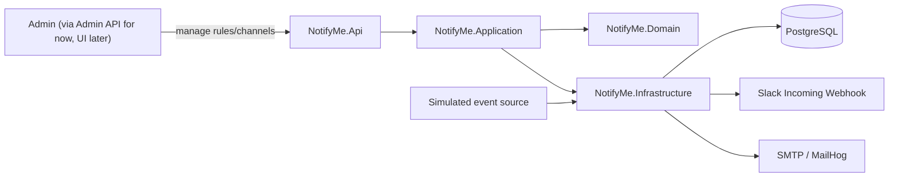
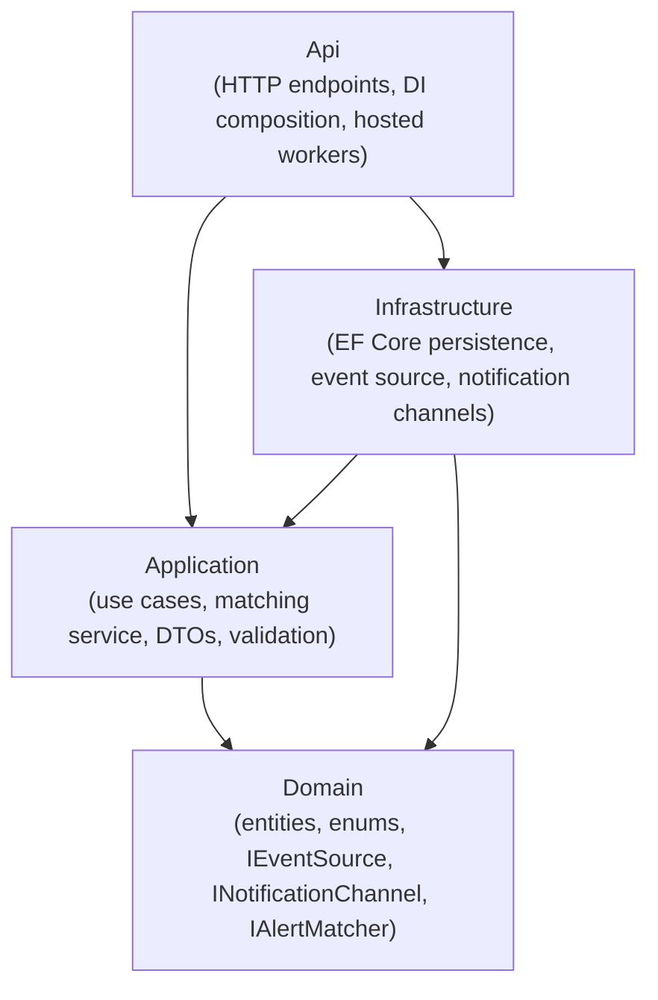

# Architecture overview

## System context

NotifyMe lets an admin configure alert rules (what kind of event, at what severity, matched on
what criteria) and channel subscriptions (where to send matching notifications: Slack, Email,
more later). Behind the scenes, an ingestion pipeline pulls in events, matches them against
active alert rules, and dispatches notifications over the subscribed channels.

## Component / layering view

Clean Architecture with a strict dependency direction (see ADR-0002):

`Domain` has no outward dependencies. `Application` depends only on `Domain`. `Infrastructure`
implements interfaces declared in `Domain`/`Application`. `Api` is the only project allowed to
reference all three, and is where dependency injection wires concrete implementations to
interfaces.

## Pipeline flow

1. `EventIngestionWorker` polls the configured `IEventSource` (currently `SimulatedEventSource`,
   see [`event-ingestion.md`](event-ingestion.md)) on an interval.
2. Raw events are normalized into `NormalizedEvent`.
3. `EvaluateAlertRulesService` (Application layer) matches normalized events against active
   `AlertRule`s.
4. For each match, `DispatchNotificationUseCase` resolves the relevant `Subscription`(s) and
   channel(s) and sends via `INotificationChannel` (see
   [`notification-channels.md`](notification-channels.md)).
5. Each attempt is recorded as a `Notification` with a status (Pending/Sent/Failed), queryable
   via the Admin API's notification history endpoint.

## Operational concerns

- **Logging**: Serilog (console sink, configured from the `Serilog` appsettings section) with
  correlation-id log scopes threaded through the ingestion -> match -> dispatch pipeline.
- **Health**: `GET /health` reports the Postgres dependency's status via
  `Microsoft.Extensions.Diagnostics.HealthChecks`.
- **Configuration**: layered `appsettings.json` -> `appsettings.{Environment}.json` -> user
  secrets (Development only) -> environment variables, the standard ASP.NET Core host
  configuration order; no real secrets are committed anywhere in the repo (see
  [`../runbook.md`](../runbook.md)).
- **Errors**: every exception reaching the Api layer is normalized to an RFC 7807
  `ProblemDetails` response by `NotifyMeExceptionHandler`, with unrecognized exceptions mapped to
  a generic 500 (no internal details leaked) and logged server-side.

## Related documents

- [`event-ingestion.md`](event-ingestion.md) - the simulated event source and its extension seam.
- [`notification-channels.md`](notification-channels.md) - the channel abstraction and how to add
  a new one.
- [`data-model.md`](data-model.md) - entities and their relationships.
- [`../api/admin-api.md`](../api/admin-api.md) - the Admin API contract.
